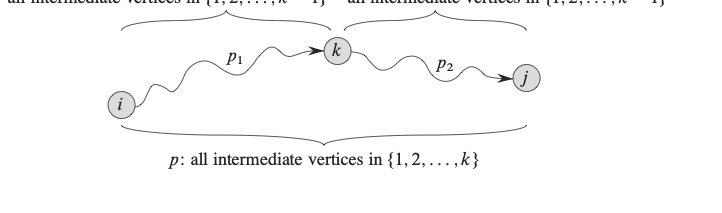
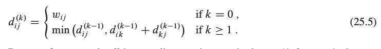
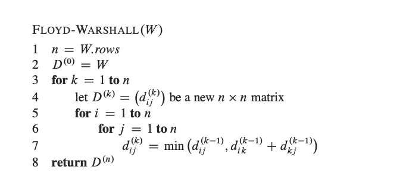
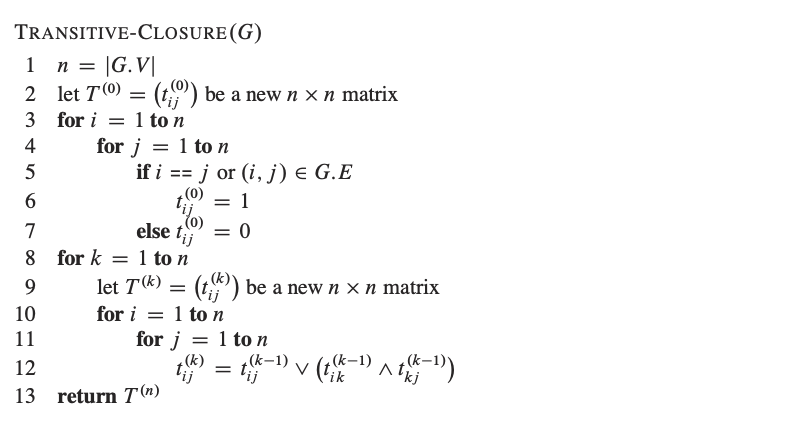

# 플로이드 워셜
- 플로이드 워셜 알고리즘은 모든 페어의(G = (V, E)) 최소 path를 찾기 위해 고안되었습니다. 
- 플로이드 워셜의 알고리즘은 O(V^3)의 시간이 걸립니다. 

## The structure of a shortest path
플로이드 워셜 알고리즘은, 가장 짧은 길 중간의 점들을 고려하는 것으로 시작됩니다. 
즉 P = <v1, v2, v3, v4, v5 ... vl>이라면  p의 v1 과 v2를 잇는 가장 짧은 길의 중간점들은 {v2, v3, v4 , v5 ... vl-1}이 될 것입니다.

## 플로이드 워셜 알고리즘의 준수 사항
- 어느 vertices라도(G) 는 V = {1, 2, ... n}에 포함되어야 한다.
- i, j의 페어의 vertices들은 V에 속해있는 {1, 2, ... k}에 존재 한다.
- p라는 패스를 가장 적은 가중치로 봐야 한다. 

## A recursive solution to the all-pairs shortest-paths problem
- d(k)_ i j라고 가정 하게 된다면 k는 {1, ... k }집합 즉 verties에 속해야 한다. 즉 k만큼 정점들이 더해질 수 있다.
- 초기 조건 k == 0일 때 중간 지점이 없다는 것을 의미합니다. 
- 재귀적인 관계식으로 k >= 1일 때 중간에 점점이 포함될 수 있음을 의미합니다. 

## Computing the shortest-path weights bottom up

플로이드 워셜의 수도 코드

1. n = k.rows
    - n은 그래프의 정점을 의미합니다. w.rows는 가중치 행렬 w의 행 개수로, 그래프에 있는 정점의 수와 동일합니다.
2. D(0) = w
    - 중간에 거쳐가지 않는 초기 경로를 세팅합니다.
3. for k = 1 to n
    - 정점의 개수를 하나씩 늘려가는 과정입니다. 중간에 포함될 수 있는 정점들을 하나씩 추가하면서 최단 경로를 갱신합니다. 
4. let D(k) = (d(k)ij) be a new n × n matrix
    - 새로운 n * n 행렬 D(k)를 만듭니다. 행렬은 중간 지점이 {1, 2, ... k }까지 재사용이 가능한 상태에서 최단 경로 가중치를 저장하는 행렬입니다.
5. for i = 1 to n
    - i에서 다른 정점으로 가는 최단 경로를 계산하려 합니다.
6. for j = 1 to n 
    - 이 반복문은 도착 정점 j에 대해 반복합니다. 즉 i에서 j로 가는 최단 경로를 계산합니다.
7. d(k)ij = min(d(k-1)ij, d(k-1)ik + d(k-1)kj)
    - i에서 j로 가는 최단 경로를 계산합니다.
    - d(k-1)ij는 중간  정점이 (1, 2... k-1일 때 최단 경로 가중치 입니다.
    - d(k-1)ik + d(k-1)kj는 i에서 k를 거쳐 j로 가는 경로의 가중치 입니다. 즉 k번 정점을 거쳐 가는 경로입니다. 
    - 둘 중 작은 값을 선택해서 d(k)ij에 저장합니다. 이 과정을 통해 중간 정점을 k까지 포함했을 때의 최댄 경로를 결정하게 됩니다.

## 전이 폐쇄
1. 전이 폐쇄 정의
    - 유향 그래프 G의 전이 폐쇄는 정점 집합 V와 간선 집합 E로 이루어진 그래프예요.
    - 여기서 E는 i에서 j로 가는 경로가 존재하는 경우에만 간선 (i, j)가 존재합니다.
    - 즉, 전이 폐쇄는 경로가 존재하는지 여부를 나타내는 그래프입니다. 실제 경로의 길이나 가중치는 중요하지 않고, 경로의 존재 여부만 확인합니다.
2. Floyd-Warshall 알고리즘을 사용한 전이 폐쇄 구하기
   - 전이 폐쇄를 구하는 한 가지 방법은 그래프의 모든 간선의 가중치를 1로 설정한 뒤, Floyd-Warshall 알고리즘을 사용하는 방법입니다.
   - Floyd-Warshall 알고리즘은 모든 정점 쌍 사이의 최단 경로를 구하는 알고리즘인데, 여기서는 경로의 존재 여부를 확인하는 데 사용할 수 있어요.
   - i에서 j로 가는 경로가 있으면 최단 경로의 길이 dij는 n보다 작게 나옵니다. 경로가 없다면 dij는 무한대(∞) 또는 매우 큰 값으로 처리되어요.
   - 이 방법의 시간 복잡도는 O(n^3)입니다. 하지만 이 방식은 공간과 계산량 측면에서 효율적이지 않을 수 있어요.
3. 논리 연산을 이용한 더 효율적인 방법
   - 위 방법과 비슷하지만, Floyd-Warshall 알고리즘에서 사용하는 **산술 연산(min, +)**을 논리 연산으로 바꿔서 좀 더 효율적으로 처리할 수 있어요.
   - OR 연산(∨): 경로가 하나라도 있으면 참(1)으로 처리합니다.
   - AND 연산(∧): 경로가 모든 조건을 만족하는 경우에 참(1)으로 처리합니다.
   - 이런 논리 연산을 이용하면 경로의 존재 여부만 계산할 수 있어서 시간과 공간을 절약할 수 있습니다.
4. 재귀적 정의 (경로 존재 여부)
   - t(k)ij는 정점 i에서 j로 가는 경로가 존재하는지 여부를 나타냅니다. 이때 중간에 거쳐가는 정점들은 {1, 2, ..., k} 집합 내에 있어야 합니다.
   - t(k)ij = 1이면 i에서 j로 가는 경로가 존재한다는 의미입니다.
   - t(k)ij = 0이면 경로가 없다는 뜻입니다.
   - 이 재귀적인 정의는 Floyd-Warshall 알고리즘에서 최단 경로를 구할 때 사용하는 방식과 매우 비슷합니다. 다만 경로의 길이를 고려하는 대신, 경로가 있는지 없는지를 확인하는 데 초점이 맞춰져 있습니다.
5. 최종 결과
   - 마지막으로, 모든 정점에 대해 중간 정점이 {1, 2, ..., n}인 경우까지 고려했을 때, t(n)ij = 1인 경우에만 전이 폐쇄 그래프 G에 (i, j)라는 간선을 추가합니다.
   - 이렇게 하면 전이 폐쇄 그래프를 완성할 수 있어요.

## 시간복잡도 분석: Floyd-Warshall vs. 전이 폐쇄 알고리즘
Floyd-Warshall 알고리즘과 전이 폐쇄 알고리즘 모두 시간 복잡도가 **O(n³)**입니다. 즉, 두 알고리즘 모두 동일한 시간 복잡도를 갖습니다. Python에서의 기본 산술 연산(min/max, 덧셈 등)은 모두 O(1)로 처리되지만, 전체 알고리즘을 몇 번 반복해서 실행하느냐가 최종 시간 복잡도를 결정짓습니다.

### Floyd-Warshall 시간 복잡도:
- Floyd-Warshall 알고리즘에서, 우리는 세 개의 중첩 반복문을 가지고 있어, 각 반복문이 n번씩 반복됩니다.
- 즉, 경로 존재 여부를 확인하거나 최단 경로 거리를 계산하기 위해 **n x n x n = O(n³)**의 연산이 발생합니다.

### 전이 폐쇄 알고리즘 시간 복잡도:
- 전이 폐쇄를 구하는 알고리즘도 Floyd-Warshall과 구조가 비슷합니다. 세 개의 중첩 반복문에서 각 반복문은 n번씩 실행되며, 각 정점에 대해 논리 연산(AND, OR)을 수행합니다.
- 이 논리 연산도 Python에서 O(1)이므로, 전체적으로 **O(n³)**의 시간 복잡도가 동일하게 적용됩니다.

### 공간 복잡도 분석
공간 복잡도 또한 이 두 알고리즘은 동일합니다.
### Floyd-Warshall 공간 복잡도:
- Floyd-Warshall 알고리즘은 n x n 크기의 행렬을 사용해 각 정점 간의 경로를 저장합니다.
- 이때, 공간 복잡도는 **O(n²)**가 됩니다.
### 전이 폐쇄 알고리즘 공간 복잡도:
- 전이 폐쇄 알고리즘도 동일하게 n x n 크기의 행렬을 사용해 정점 간의 경로 존재 여부를 - 저장하므로, 공간 복잡도는 **O(n²)**로 Floyd-Warshall과 동일합니다.
### "시간과 공간을 절약"할 수 있다는 의미
책에서 언급된 "시간과 공간을 절약"할 수 있다는 부분은 아마도 실제 구현에서의 미세한 차이를 의미하는 것일 가능성이 높습니다.
### 덧셈(min 연산 포함)과 논리 연산의 차이:
- 논리 연산(AND/OR)은 일반적으로 덧셈이나 비교 연산(min)을 수행하는 것보다 조금 더 가볍게 처리될 수 있습니다. 하지만 Python 기준으로는 이 차이는 O(1) 연산에서 거의 무시될 정도로 미세합니다.
- 따라서 이 부분에서 아주 소소한 성능 향상이 있을 수 있지만, 알고리즘의 시간 복잡도에 직접적인 영향을 미치지는 않습니다.
### 메모리 사용 차이:
- Floyd-Warshall에서는 거리(숫자)를 저장하기 위해 더 많은 메모리가 필요할 수 있습니다. 반면, 전이 폐쇄 알고리즘에서는 1 또는 0만 저장하면 되므로 이론적으로는 각 요소당 더 적은 공간이 필요할 수 있습니다.
- 하지만 Python에서 숫자나 불리언 값 모두 메모리를 크게 다르게 사용하는 것은 아니기 - 때문에, 공간 절약도 그렇게 눈에 띄는 차이는 아닐 것입니다.
### 결론
- Floyd-Warshall과 전이 폐쇄 알고리즘의 시간 복잡도와 공간 복잡도는 동일하게 **O(n³)**와 **O(n²)**입니다. "시간과 공간을 절약할 수 있다"는 표현은 논리 연산이 덧셈 연산에 비해 상대적으로 빠르고 메모리를 덜 사용할 수 있다는 점을 미세하게 고려한 것일 수 있지만, 이러한 차이는 큰 영향을 주지 않으며, 알고리즘의 복잡도 측면에서 중요한 요소로 작용하지 않습니다.

https://www.google.com/url?sa=i&url=https%3A%2F%2Fjeevangupta.com%2Fpython-string-tutorial-learning-python-string-with-example%2F&psig=AOvVaw1YafDcC17ozw09es2WtjFX&ust=1738974542238000&source=images&cd=vfe&opi=89978449&ved=0CBQQjRxqFwoTCIjw95CnsIsDFQAAAAAdAAAAABAE