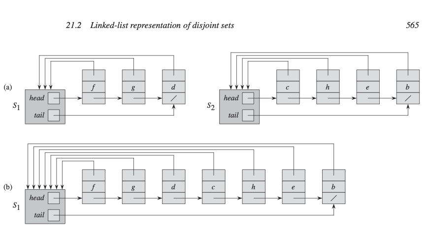
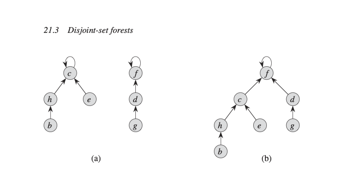
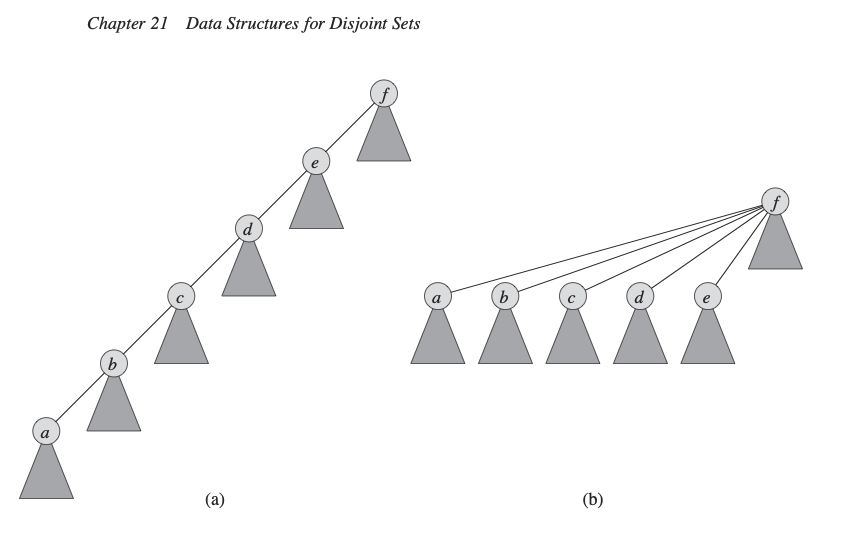

# Data Structures for Disjoint Sets

## 21.1 Disjoint-set operations

- DisJointSet을 Set Collections를 갖고 있습니다. 
  $$
  S = {S_1, S_2..., S_k }
  $$
- 우리는 Dis jointSet을 대표하는 멤버로 identify할 수 있습니다. 


- Operation
  - Make-Set(x) : 새로운 오직 x만 포함되는 새로운 set을 만듦. 이 set은 disjoint하기 때문에, x와 set들과 접점을 두게 하면 안됩니다.
  - Union(x, y): dynamic sets인 x와 y를 포함하는, S_x, S_y의 집합을을 새로운 set으로 만듭니다. 이 S_x, S_y의 집합들이 DisJoint해야하며, 새로운 집합은 S_x, S_y에 존재해야 합니다.
  - Find-Set(x): x를 포함하는 유니크한 pointer의 대표값을 찾습니다.

## LinkedList기반 Represntaion Disjoint Set
아래 그림같이 간단한 방법으로 Representaion을 구현할 수 있습니다. head는 집합을 point하고 있으며, tail은 다음의 원소를 point하고 있는 구조 입니다. <br/>
MakeSet,과 FindSet을 하기 위해서는 O(1)이 필요하다. **하지만 Union하기 위해서는 이어붙이는 모든 원소에 대한 탐색이 있기 때문에 Y의 원소만큼의 시간 복잡도가 소요된다.**


## Disjoint-set forests 분할집합 트리
빠른 disjoint의 implemetation을 위해서는 tree가 사용될 수 있습니다. Root는 집합의 Represent를 나타내는 것을 확인할 수 있습니다. 하지만 아래 그림처럼 구현하게 되면 Linked List방식과 시간적으로 차이가 없습니다. 


## Heuristics to improve the running time: 실행시간 개선을 위한경험적 방법
- 랭크에 의한 합치기 (Union by rank): 노드의 높이(랭크)를 기준으로 트리를 합치며, 작은 랭크의 트리가 큰 랭크의 트리에 연결되도록 하여 트리의 높이를 최소화하는 방법.
- 경로 압축 (Path compression): FIND-SET 연산 중, 탐색 경로에 있는 모든 노드를 루트에 직접 연결하여 트리의 높이를 줄이는 방법. 이는 UNION 연산 시 트리 구조를 더욱 효율적으로 만듭니다.



## Implementation
MAKE-SET: 새로운 집합을 생성할 때, 노드의 부모를 자기 자신으로 설정하고, 초기 랭크는 0으로 설정합니다.
FIND-SET: 경로 압축을 통해, 트리의 높이를 줄이고, 루트를 찾으면서 경로 상의 모든 노드를 루트에 직접 연결합니다.
UNION: 두 트리의 루트를 비교하여, 랭크가 높은 루트가 부모가 되도록 설정합니다. 만약 두 루트의 랭크가 같으면, 임의로 하나를 부모로 설정하고 부모의 랭크를 1 증가시킵니다.
LINK: UNION에서 호출되어 두 트리의 루트를 연결하는 하위 절차입니다.

## 실제 구현해보기 
```python
import sys

v, e = map(int, input().split())
parent = [0] * (v+1)
for i in range(1, v+1):
    parent[i] = i

def find_parent(parent, x):
    if parent[x] != x:
        parent[x] = find_parent(parent, parent[x])
    return parent[x]

def union_parent(parent, a, b):
    a = find_parent(parent, a)
    b = find_parent(parent, b)
    if a < b:
        parent[b] = a
    else:
        parent[a] = b

cycle = False
for _ in range(e):
    a, b = map(int, input().split())
    if find_parent(parent, a) == find_parent(parent, b):
        cycle = True
        break
    else:
        union_parent(parent, a, b)

if cycle:
    print('사이클이 존재합니다')
else:
    print('사이클이 존재하지 않습니다')
```