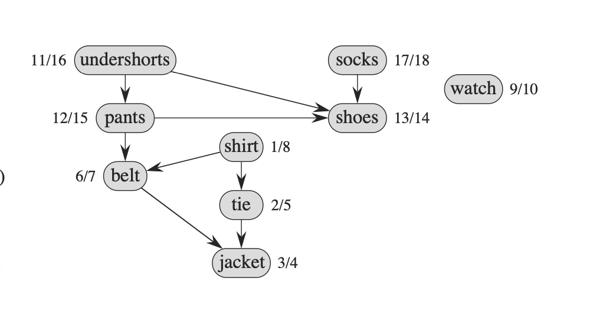
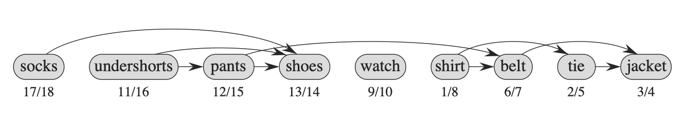

# 위상 정렬에 관하여
- 위상 정렬은 depth first search이다.
- 위상 정렬은 DAG(Directed Acyclic Graph)이다. 
- G = (V, E) 이며, edge(u, v)에서 u는 v보다 순서가 먼저 이다.

## 대게의 현실세계 문제에 관하여

- 현실세계 문제는 directed acyclic graphs(비순환 그래프)를 활용하여 문제를 나타낸다.

- 여기서 먼저 해결해야할 것들이 있는다(가령 신발 전에 양말 신기 같은)
- edge(u, v)로 나타낸다면 u는 v보다 먼저 해결되야 한다.
- 아래는 위상정렬의 DAG의 순서가 있는 수평의 라인이다.

## 요약 해석
1. **간선(u, v)**가 DAG에 존재한다고 가정합니다.
2. DFS가 간선(u, v)을 탐색할 때, v는 **gray(회색)**일 수 없습니다. 회색이라면 v는 u의 조상이 되고, 이는 DAG에서 역방향 간선이 존재함을 의미하지만 이는 모순입니다. DAG는 순환이 없기 때문에 역방향 간선이 있을 수 없습니다.
3. 따라서, v는 **white(흰색)**이거나 **black(검은색)**이어야 합니다.
    - v가 흰색이면, DFS 탐색 중에 v는 u의 자손이 됩니다. 이 경우 v는 u보다 먼저 종료되므로 v의 종료 시간 v.f는 u의 종료 시간 u.f보다 작습니다.
    - v가 검은색이면, 이미 v의 탐색이 끝났기 때문에 v.f는 이미 설정되어 있습니다. 이때 u는 아직 탐색이 진행 중이므로, u 의 종료 시간은 아직 설정되지 않았습니다. u의 종료 시간이 설정될 때는 당연히 v.f가 u.f보다 작습니다.
따라서, DAG에서 **모든 간선(u, v)**에 대해 v.f < u.f라는 결과를 얻게 되며, 이것이 증명입니다.
설명 추가
DFS에서의 시간 기록 DFS 알고리즘에서는 정점을 방문할 때 시작 시간과 종료 시간을 기록합니다.
DFS가 정점을 처음 방문하면 그 정점의 색을 흰색에서 회색으로 변경하고 시작 시간을 기록합니다.
그 후 자식 정점을 재귀적으로 방문한 후에 모든 자식 방문이 끝나면 다시 돌아와서 정점의 색을 회색에서 검은색으로 변경하고 종료 시간을 기록합니다.

### 레퍼런스
나무위키
introduction of alogorithms